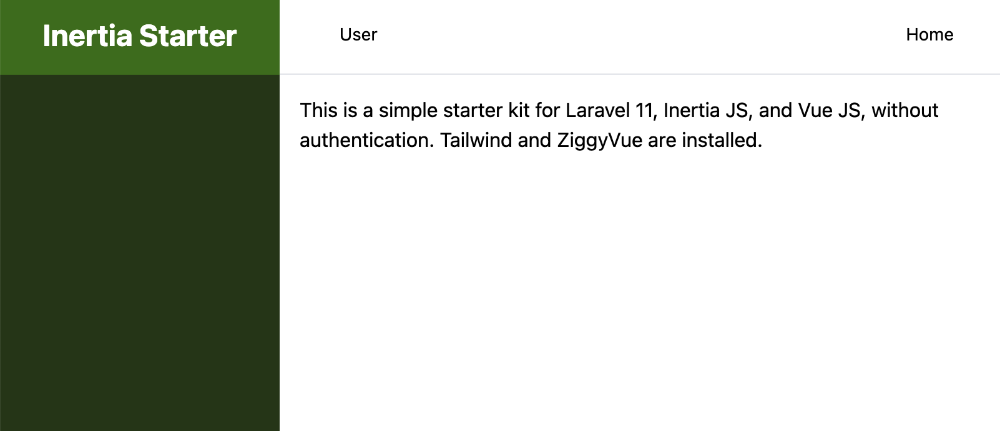

# Inertia-Starter
 This is a simple starter kit for Laravel 11, Inertia JS, and Vue JS, without authentication. Tailwind and ZiggyVue are installed.

# github
https://github.com/JonVadar/Laravel-Inertia-Vue-Starter.git

## 기본 프로젝트 세팅
Inertia + Vue 3 + TailwindCSS + Laravel 11 

## Requirements
- Laravel 11
- Vue 3
- Inertia
- TailwindCSS

## Setup
```
composer install

npm install

cp .env.example .env

php artisan key:generate

touch database/database.sqlite

php artisan migrate

npm run dev

php artisan serve
```

